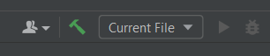
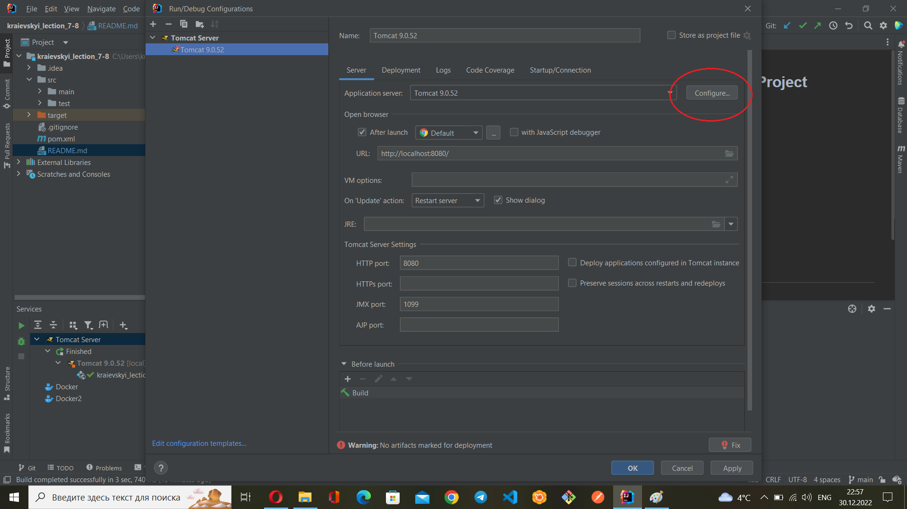
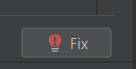
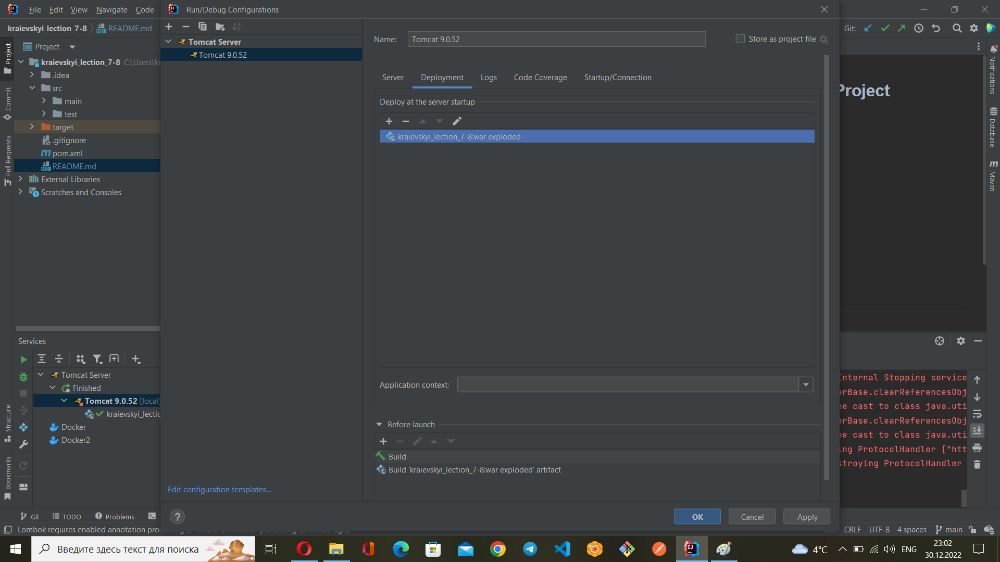

## ⚙ How to Install and Run the Project
* Install JDK v17
* Clone this project to your JDK
* Run "mvn package" in terminal
* Install Apache Tomcat v9.0.52
* Configure Apache Tomcat in JDK
* Click on debug on the toolbar to use the application

## 🔨 Configure Apache Tomcat
1. On the toolbar, select Current File -> Edit Configurations

2. Add Apache Tomcat - Local
3. Click on Configure and choose the path to installed Apache Tomcat

4. Click on Fix

Select **kraievskyi_lection_7_8_war_exploded**

5. Delete text from Application context

Just leave it empty

6. Click OK

# 🗝️ Login details

* Login = "Alex@gmail.com"
* Password = "12345"
---
* Login = "John@gmail.com"
* Password = "qwerty"
---
* Login = "David@gmail.com"
* Password = "password" 
